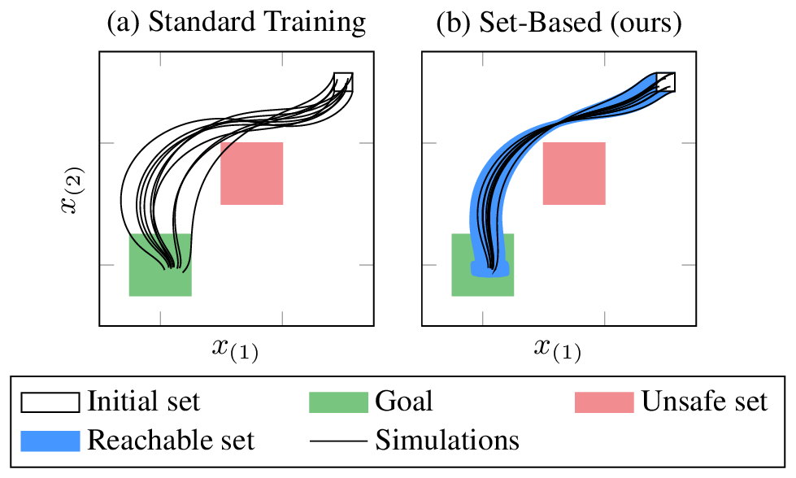

      
# Repeatability Package

This folder contains a repeatability package for:

- Paper:  <a href="https://arxiv.org/abs/2408.09112"> `Training Verifiably Robust Agents Using Set-Based Reinforcement Learning` </a>
- Venue: `under review`

  Reinforcement learning uses neural networks as agents to solve complex control tasks.
  However, neural networks are sensitive to input perturbations, which makes their deployment in safety-critical environments challenging and thus their formal verification necessary.
  This work lifts recent results from the formal verification of neural networks to reinforcement learning in continuous state and action spaces.
  While previous work mainly focuses on adversarial attacks for robust reinforcement learning, we augment reinforcement learning with set-based computing: We enclose all possible outputs for a set of perturbed inputs and compute a gradient set for training, i.e., each possible output has a different gradient. 
  Thereby, we can control the size of the propagated sets by selecting gradients pointing toward its center, which simplifies the formal verification across different verification methods. 
  Our agents are verifiably more robust than agents obtained by previous approaches, making them more applicable in safety-critical environments.

  

## Folder Structure

- `./`                       : base path                             
  - `./code`                : path to code                          
    - `./cora`              : path to [CORA](https://cora.in.tum.de/)
    - `./scripts`           : path to auxiliary scripts                 
    - `./main.m`            : **main Matlab script**                  
  - `./results`             : path to results (created after execution)
    - `./<benchmark>`       : path to results of executed benchmark
  - `./Dockerfile`          : Dockerfile
  - `./license.lic`         : place [license file](#option-2-license-file) here
  - `./README.md`           : read me file (this file)
  - `./run.sh`              : **main script** to run [from command line](#run-from-command-line-recommended)
  - `./settings.sh`         : settings for scripts
  - `./screen.sh`           : script to run `run.sh` [within a linux screen](#run-from-command-line-recommended)

## Step 1: Installation
This folder contains the code as well as a docker file to run the code in one click (see below).

However, you need to provide a Matlab license.
You can specify i) a [license server](#option-1-license-server-recommended), ii) a [license file](#option-2-license-file), or iii) [run it directly in Matlab](#option-3-install-matlab-and-required-toolboxes-not-recommended):

### Option 1: License server (recommended)

- Ask your Matlab administrator if a Matlab license server is available.
- In `settings.sh`, configure the license server : `LICENSE_SERVER=<port>@<hostname>`. 
- Proceed with [Step 2: 🔵 Run from command line](#-run-from-command-line-recommended)

### Option 2: License file
Download a license file `license.lic` to run the code:
- Create a Matlab license file: 
	For the docker container to run Matlab, one has to create a new license file for the container.
	Log in with your Matlab account at https://www.mathworks.com/licensecenter/licenses/.
	Click on your license, and then navigate to
	1. "Install and Activate"
    1. "View activated computers"
	1. "Activate a Computer"
	(...may differ depending on how your licensing is set up).
- Choose:
	- Release: `R2024b`
	- Operating System: `Linux`
	- Host ID: `0242AC110002` (= Default MAC of docker container)
	- Computer Login Name: `matlab`
	- Activation Label: `<any name>`
- When prompted if the software is already installed, choose "Yes".
- Download the file and place it next to `Dockerfile`.
- Proceed with [Step 2: 🔵 Run from command line](#-run-from-command-line-recommended).

### Option 3: Install Matlab and required toolboxes (not recommended)

Install Matlab on your system and install all required toolboxes for CORA (see Sec. 1.3 in [CORA manual](https://cora.in.tum.de/manual)). The CORA repository is already included in `./code/cora`, so you don't have to clone it.

Proceed with [Step 2: 🟠 Run from Matlab](#-run-from-matlab).

## Step 2: Run the code

### 🔵 Run from command line (recommended)

You can run the evaluation in one click in a docker container using the `run.sh` script (see [bug fix: windows/linux line breaks](#known-error-messages) below):

	./run.sh <evalname> <gpu-device>
	
where the argument `<evalname>` is used to name the evaluation run (defaults to datetime),
and the optional argument `<gpu-device>` is used to select the GPU (see [GPU settings](#gpu-settings) below).

The results will be stored to `./results/<evalname>` after the evaluation finishes.
To view intermediate results during the evaluation, you can copy the current `results` folder out of the docker container using

    docker cp "$DOCKER_NAME":/results .

where `DOCKER_NAME` is as in `settings.sh` or using `docker ps`.

If you are using [linux screens](https://www.howtogeek.com/662422/how-to-use-linuxs-screen-command/),
you can also call

    ./screen.sh <evalname> <gpu-device>

which might be helpful when running the script on a server to ensure it finishes correctly even if your connection is interrupted.
You can always detach from the screen using `CTRL+A+D` and reattach using 

    screen -rd $SCREEN_NAME

where `SCREEN_NAME` is as in `settings.sh` or using `screen -ls`.

#### Variables

To set the variables `DOCKER_NAME` and `SCREEN_NAME` automatically, you can call

    source settings.sh <evalname>

which makes the variables available in the current terminal instance,
where `<evalname>` is again the name of the evaluation.

#### GPU Settings

For docker to use the GPU, you have to specify the `<gpu-device>` docker should use.
You can find your available GPUs using the command `nvidia-smi`.
Possible options are the GPU id (e.g., `0`), `all`, and `none` (default).
Read more about it here: https://docs.docker.com/desktop/features/gpu/.

Please note that this setting might not be necessary for this repeatability package.

### 🟠 Run from Matlab

Alternatively, open this directory in Matlab and run:

	addpath(genpath('./code')); 
    main('<evalname>');

where the optional argument `<evalname>` is used to name the evaluation run (defaults to datetime).
The results will be stored to `./results/<evalname>`.
	
**Note:** Please ensure that all required toolboxes for CORA are installed (see [Step 1: Option 3](#option-3-install-matlab-and-required-toolboxes-not-recommended) above).

### Important Notes

- By default we only evalate a demo training for the Quadrotor 1D benchmark to reduce runtime. For extensive evalutaion change the mode in `main.m`.
- When running the evaluation in docker, docker might randomly stop if not enough memory is available.

### Known error messages

If running `run.sh`/`screen.sh` results in obscure error messages (`$'\r': command not found`), 
it might be due to different line breaks in `run.sh`/`screen.sh` using windows/linux. 
You can fix it using:

    sed -i 's/\r$//' *.sh

### Code Description
 
The main contribution is located in the subfolder rl of the neural network section nn

    .code/cora/nn/rl

It contains 6 classes and an additional folder with helper functions.
- **@agentRL**: Abstract reinforcement learning agent class with main functions
    - *train.m* Implementation of the training loop
    - *computeAdversarialAttack.m* Implementation of adverserial attacks for adverserial training methods
    - *benchmark* Evaluates rl agents on given benchmark

- **@DDPGagent**: Deep deterministic policy gradient agent with main functions 
    - *trainNetworkStep* Implements the train step for the DDPG agent

- **@TD3agent**: Twin delayed deep deterministic policy gradient with main functions
    - *trainNetworkStep* Implements the train step for the TD3 agent

- **@actor**: Actor with main functions
    - *train.m* Implementation of the actor training step

- **@critic**: Critic with main functions
    - *train.m* Implementation of the critic training step
    - *getPolicyGradient.m* Returns the policy gradient over the critic neural network

- **@buffer**: Replay buffer with main functions
    - *fillBuffer.m* Fills buffer with new transition data
    - *getRandomBatch.m* Returns a random batch from the replay buffer
    - *storeVisualData.m* Stores trajectories during training for visualization purposes

- **@ctrlEnvironment**: Controlled environment with main functions
    - *reset.m* Resets the ctrlEnvironment
    - *step.m* Executes one control step of the environment

- Additional functions are provided in the *functions* folder

## Scripts
The folder `.code/scripts` contains scripts for the execution of the different benchmarks. 

- *dummy_benchmark_rl_agentDDPG_Quad1D.m* 
- *benchmark_rl_agentDDPG_Quad1D.m*
- *benchmark_rl_agentTD3_Quad1D.m*
- *benchmark_rl_agentDDPG_Quad2D.m*i
- *benchmark_rl_agentDDPG_Pendulum* 
- *benchmark_rl_agentDDPG_NavTask.m*

